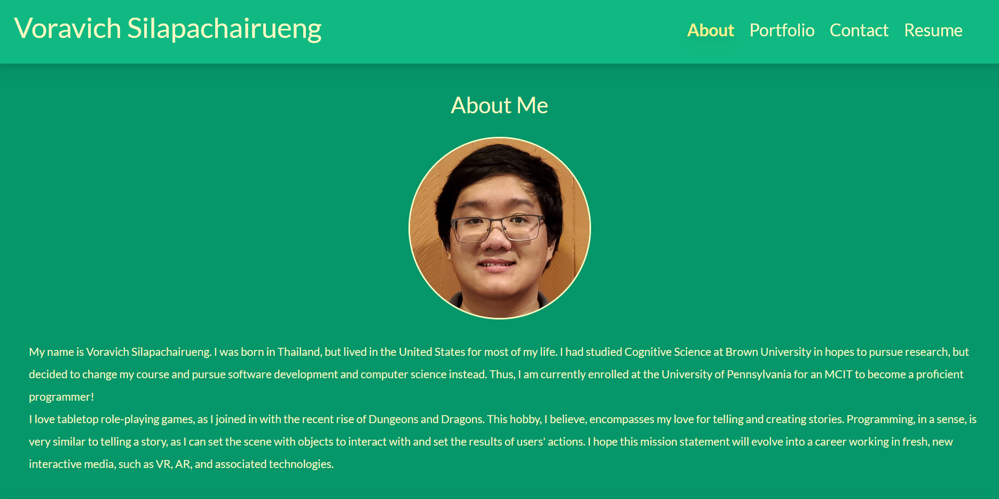

# professional-portfolio  

## Description

This project is the start of a professional portfolio deployed on GitHub. It is a demonstration of how a React front-end app will function. 

## Usage Instructions

A user will start on the About Me page. On the header, there is a navigation bar that includes a portfolio, contact, and resume section.

The portfolio consists of 6 select projects to show in my portfolio. Hovering over these projects will bring up its title and a Github logo. Clicking anywhere in the box except the log will bring up the deployed app. Clicking on the Github logo will take a user to the project's github repository.

The contact section is a form that takes a name, email, and message. As this project is fully front-end, the submission currently doesn't work, but this will be addressed in the future.

The resume section includes a link to a google drive that contains my CV. This page also contains a list of my proficiencies and skills.

At the footer, there are persistent links to my github profile, linkedin profile, and twitter.

## Screenshots

* About Me Page

* Portfolio Page

* Contact Page

* Resume Page

## License 

 

"Permissions of this strong copyleft license are conditioned on making available complete source code of licensed works and modifications, which include larger works using a licensed work, under the same license. Copyright and license notices must be preserved. Contributors provide an express grant of patent rights."

Read more about this license at: https://choosealicense.com/licenses/gpl-3.0/

## Github Repository Link

GitHub Repository: https://github.com/voravichs/voravich-react-portfolio
 
Deployed App: https://voravichs.github.io/voravich-react-portfolio/